<p align="center">
  
</p>

<h1 align="center">hashgram.io</h1>

<p align="center">
  <strong>The official live explorer, network dashboard and documentation for Hashgram Mainnet.</strong><br>
  Strict monochrome. Read-only. Every number comes from the server's own full node.
</p>

<p align="center">
  <a href="https://hashgram.io">hashgram.io</a> ·
  <a href="https://hashgram.io/api/v1/docs">API reference</a> ·
  <a href="https://hashgram.io/docs">Documentation</a> ·
  <a href="https://hashgram.io/brand">Brand kit</a> ·
  <a href="https://github.com/deepdrogo/hashgram">Chain &amp; node source</a>
</p>

<p align="center">
  
  
  
  
</p>

<p align="center">
  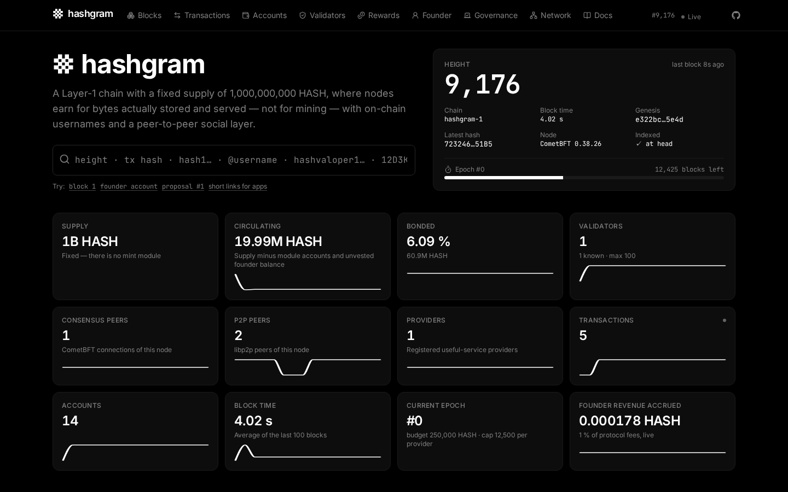
</p>

---

## What this is

**Hashgram** is a Layer-1 blockchain (Cosmos SDK / CometBFT, chain-id `hashgram-1`, launched 10 September 2026) with a fixed supply of 1,000,000,000 HASH, **useful-service rewards** for storage, relay and media nodes instead of mining, a 1 % founder revenue share with a hardcoded ceiling, on-chain usernames and a peer-to-peer social and messaging layer.

**hashgram.io** is the website that lets anyone watch it: a block explorer, a network dashboard and the rendered documentation, all updating live. This repository contains the website, its API contract, the Caddy configuration and the installer that publish it. The chain, the node and the indexer that serves the API live in the main repository, [deepdrogo/hashgram](https://github.com/deepdrogo/hashgram).

### Principles

| | |
| --- | --- |
| **Independent** | The site reads only from a full node on the same machine. It never depends on the genesis server or any remote RPC; nothing about any specific machine (IP, node id, peer id) is hardcoded. If the chain is live, the site is live. |
| **Read-only** | No wallet, no keys, no signing, no broadcasting, no prices, no exchange links. The footer says so. |
| **Honest** | Three separate node numbers, never one invented total. A hollow dot when the event stream is down. "Indexer is N blocks behind" when it is. |
| **Private** | No accounts, no cookies, no analytics, no third-party scripts or CDNs. Peer and visitor IPs are truncated to /24 (IPv4) or /48 (IPv6) everywhere — storage and logs alike. |
| **Verifiable** | The site compares the API's genesis hash to a pinned value (`e322bc23…5e4d`) and disables itself on mismatch. The indexer database is a cache: `hashgram-indexer rebuild` reproduces every response from chain state. |
| **Monochrome** | Exactly seven values — `#000000 #0D0D0D #1A1A1A #262626 #404040 #808080 #FFFFFF`. Meaning is carried by weight, spacing, borders and glyphs (✓ ✗ ▲ ▼), never by hue. A Playwright test samples every rendered pixel of every route and fails on any saturated colour. |

---

## Tour

<table>
  <tr>
    <td width="50%">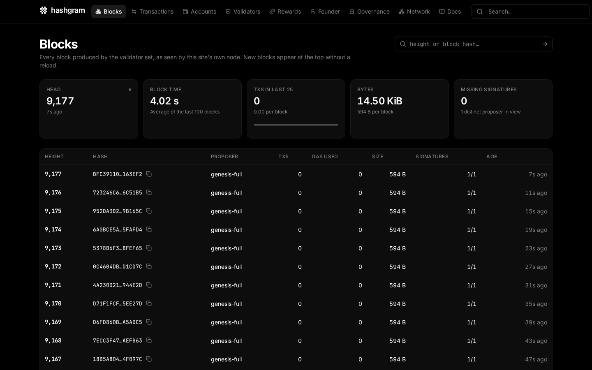<br><b>Blocks</b> — live-prepending list, block search by height or hash, proposer, gas, size and signatures present/missing.</td>
    <td width="50%">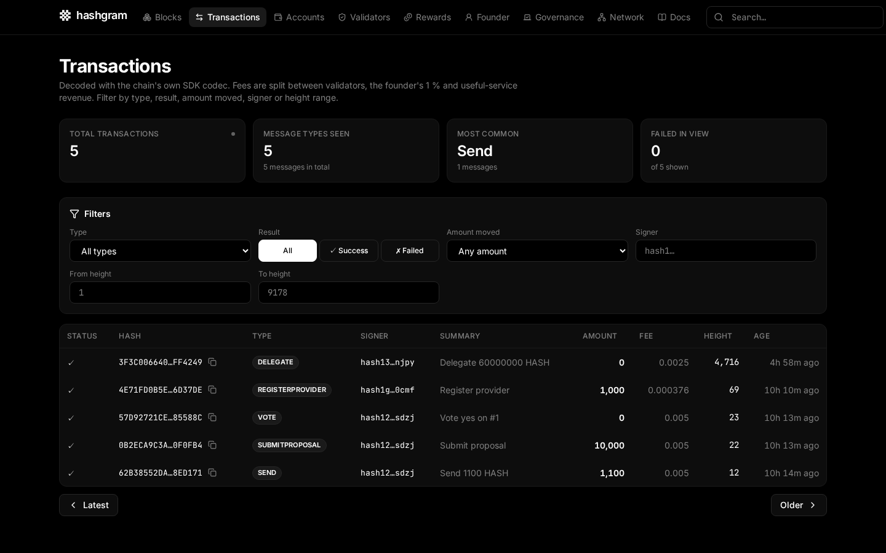<br><b>Transactions</b> — decoded by the chain's own codec; filters by type, result, amount moved, signer and height range; fee split into validators / founder 1 % / treasury.</td>
  </tr>
  <tr>
    <td>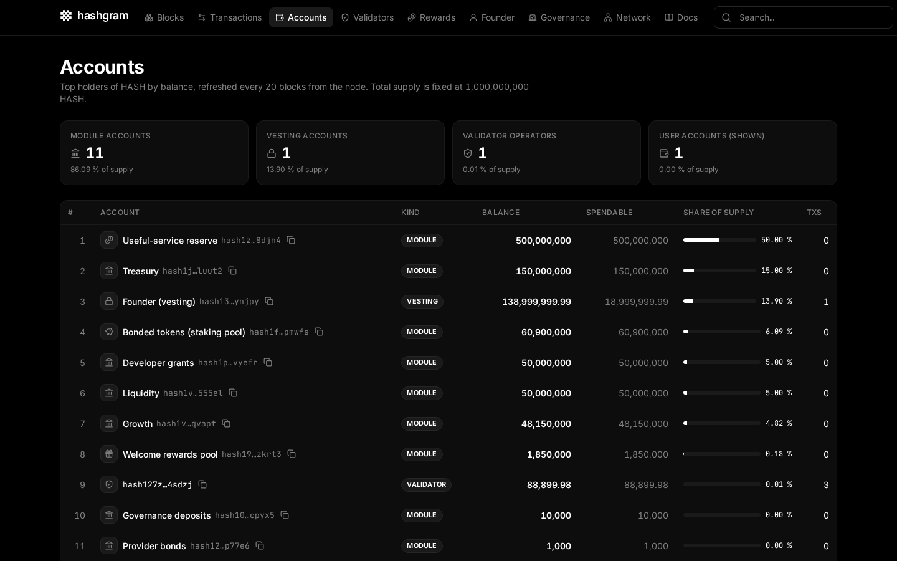<br><b>Accounts</b> — top holders with labels for every module and reserve account, kind icons, spendable vs. vesting, share of supply.</td>
    <td>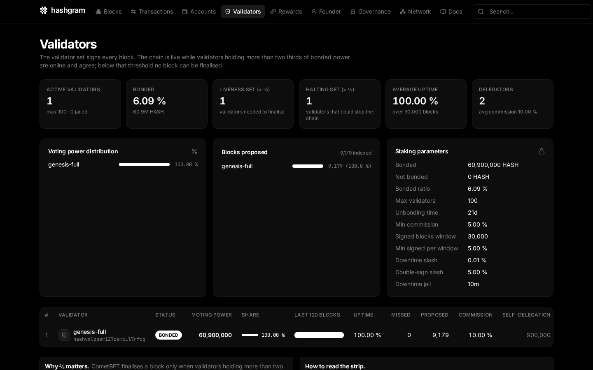<br><b>Validators</b> — voting power distribution, the ⅔ liveness and ⅓ halting sets, uptime strips of the last 120 blocks, blocks proposed, commission, delegators.</td>
  </tr>
  <tr>
    <td>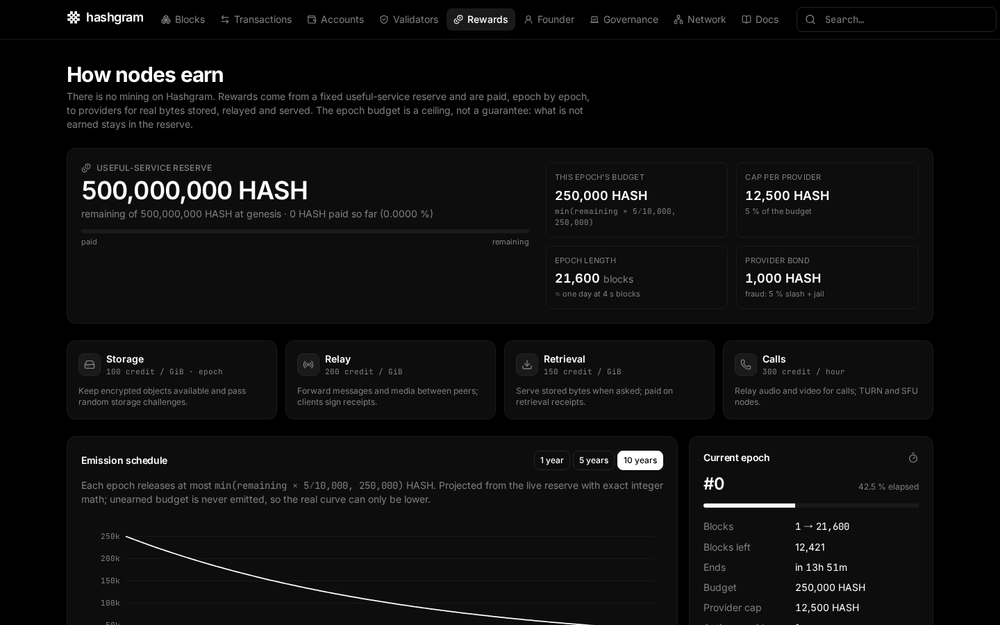<br><b>Rewards</b> — the 500,000,000 HASH reserve, this epoch's budget and per-provider cap, the exact emission rule projected 1 / 5 / 10 years, providers and payouts. <i>There is no mining.</i></td>
    <td>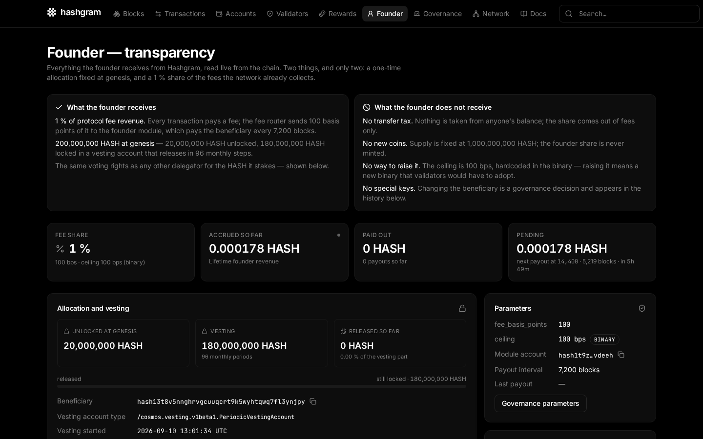<br><b>Founder</b> — what the founder receives and does not receive, the 96-step vesting chart, accrued / paid / pending fee share, delegations and voting power, payout history.</td>
  </tr>
  <tr>
    <td>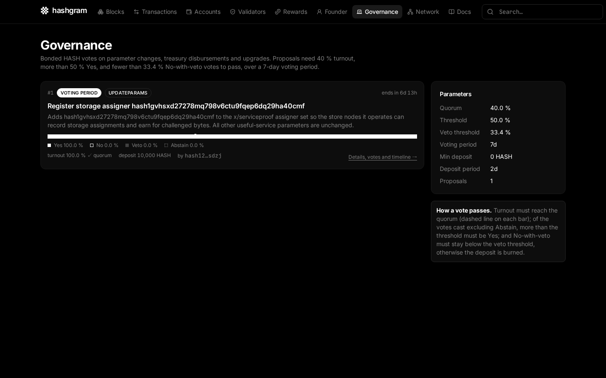<br><b>Governance</b> — proposals with monochrome tally bars against quorum, decoded messages with parameter diffs, votes and timeline.</td>
    <td>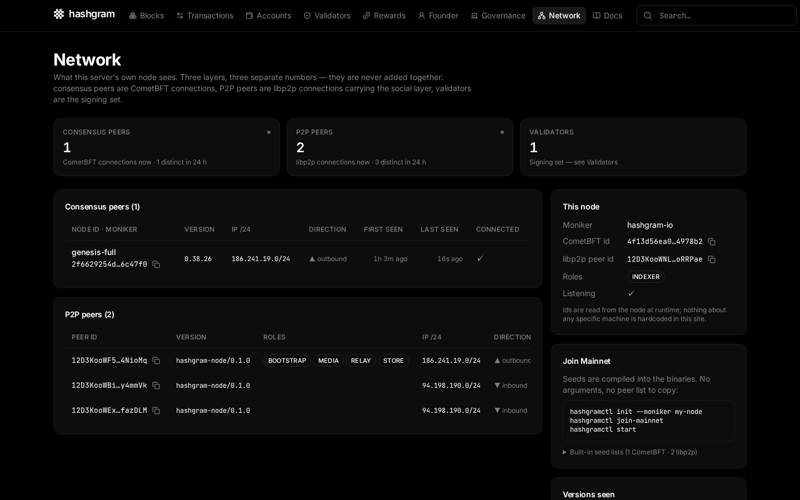<br><b>Network</b> — consensus peers, libp2p peers and validators as three numbers; peer tables with /24 prefixes; built-in seeds; fork isolation explained.</td>
  </tr>
  <tr>
    <td>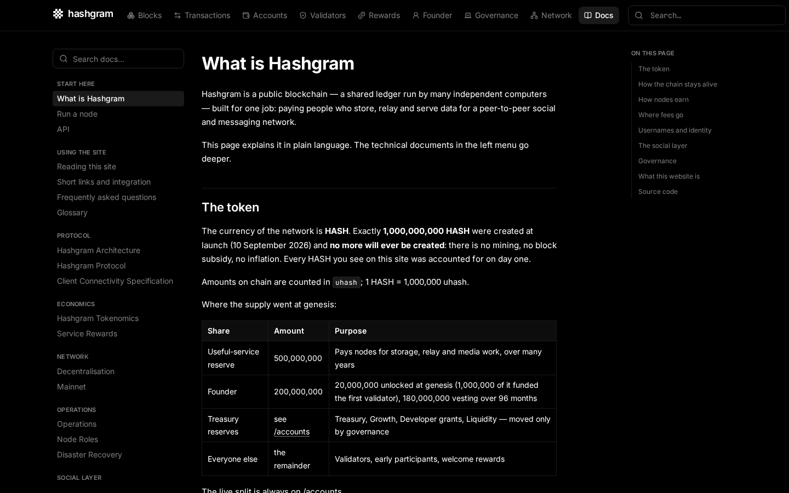<br><b>Docs</b> — the repository's documentation rendered with navigation, table of contents, full-text search, code copy and source commit, plus plain-language pages.</td>
    <td>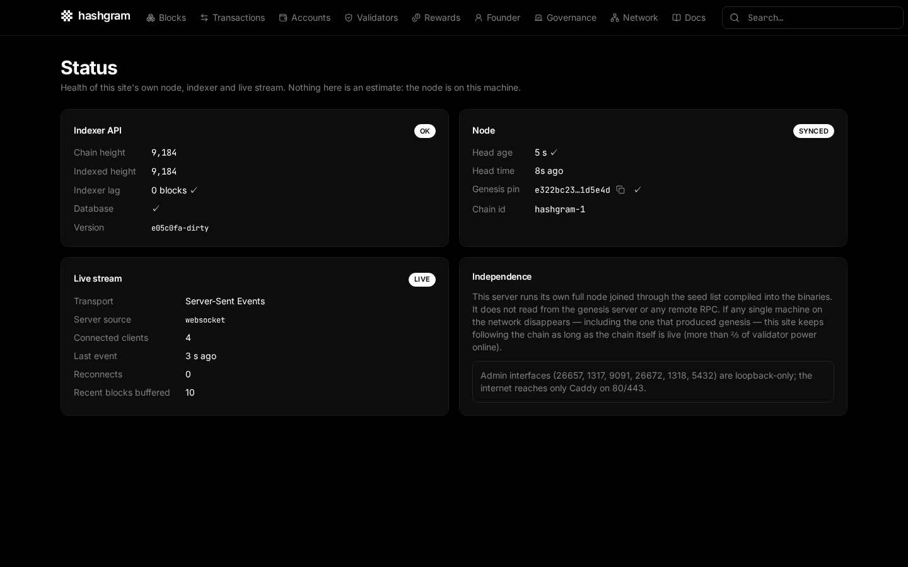<br><b>Status</b> — node sync, indexer lag, event-stream state, genesis pin check. Nothing here is an estimate.</td>
  </tr>
</table>

### On a phone

Every page is designed for phones first: stat grids become two columns, tables collapse into labelled cards, charts re-measure their container so tick labels stay legible, the docs navigation folds into a single button, and a Playwright suite checks every route at iPhone size for horizontal overflow.

<p align="center">
  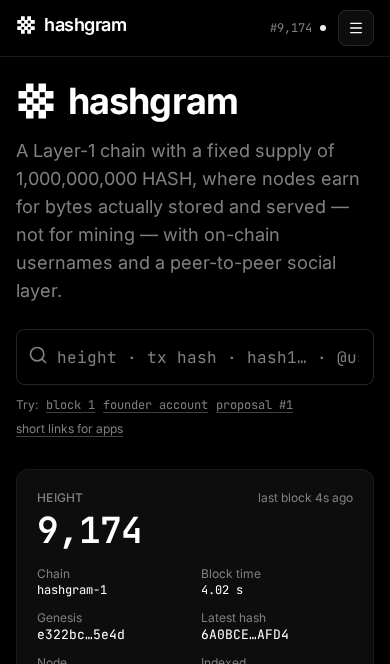
  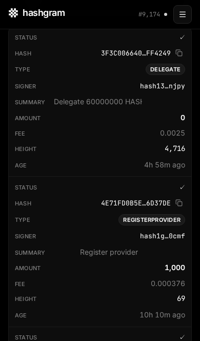
  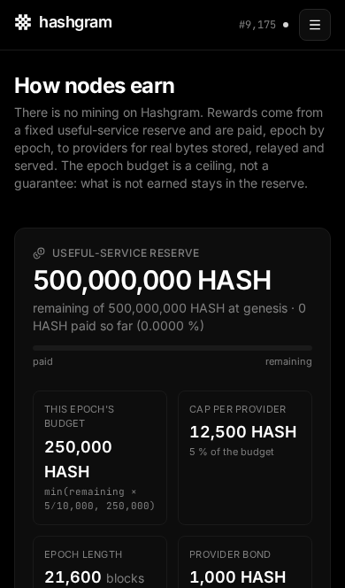
</p>

### Short links

Any application can deep-link into the explorer by appending an identifier to the site root; the site resolves it and redirects:

| URL | Opens |
| --- | --- |
| `hashgram.io/<64-hex transaction hash>` | the transaction |
| `hashgram.io/<height>` | the block |
| `hashgram.io/hash1…` | the account |
| `hashgram.io/hashvaloper1…` | the validator |
| `hashgram.io/@username` | the username's account |
| `hashgram.io/12D3Koo…` | the peer on the network page |

The same resolution is available as JSON at `GET /api/v1/search?q=…`.

---

## Brand

<p align="center">
  
  
</p>

The mark is a heavy `#` — the hash sign — whose four intersections are knocked out: the negative-space squares read as blocks, the strokes as the chain that links them. One colour, no gradients, pixel-aligned at 16 px. Three candidates were drawn and compared at 16 / 32 / 64 px before choosing:

<p align="center"></p>

The full kit — SVG and PNG marks in four variants at 16–1024 px, wordmarks, favicons, `palette.json` and the usage rules — is generated by `pnpm build:brand` and published at [hashgram.io/brand](https://hashgram.io/brand) as a single zip. Rules: clear space of ¼ mark height, minimum 16 px on screen, pure black or pure white only.

---

## Architecture

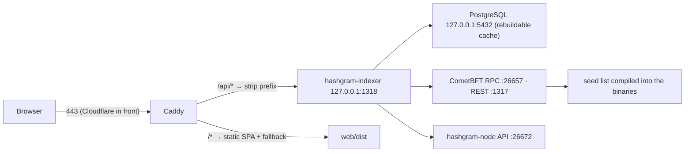

- **`web/`** — the site. SolidJS 1.9 + TypeScript + Vite 8 + `@solidjs/router`, Tailwind v4 with a seven-token palette, Lucide icons, d3 primitives for the monochrome charts, MiniSearch for docs search. Static build; no server runtime. Live data over `EventSource('/api/v1/live')` with reconnect and stale detection, polling fallback every 6 s.
- **`indexer/openapi.yaml`** — the OpenAPI 3.1 contract of the read API. `web/` generates its TypeScript types from it (`pnpm gen:api`). The Go implementation is `indexer/` in the main repository.
- **`deploy/caddy/Caddyfile`** — TLS (Let's Encrypt; DNS-01 through the Cloudflare API when a token is present), `/api/*` proxy with `flush_interval -1` for SSE, rate limits (300 req/min/IP, 30 SSE connections/min/IP, 1 KB body limit), security headers with a strict CSP, zstd/gzip, immutable caching for hashed assets, per-route Open Graph image rewrite, access logs with IPs masked to /24 // /48 and Cloudflare headers removed.
- **`deploy/systemd/caddy.service`** — hardened unit (strict filesystem, no new privileges, syscall filter, only `CAP_NET_BIND_SERVICE`).
- **`scripts/install/install-hashgram-io.sh`** — idempotent publisher: Node 22 + pnpm, `pnpm build`, sync and precompress `dist/`, install a Caddy build with the required modules, install config and unit, open only 80/443 in ufw, enable units, run `hashgramctl mainnet-preflight` and fail if it fails.
- **`docs/`** — a snapshot of the public protocol documentation from the main repository, rendered under `/docs`.

### The read API

Everything is JSON under `/api/v1`. Amounts are `uhash` integers as decimal **strings** (1 HASH = 1,000,000 uhash — parse with BigInt, never floats). Lists take `?limit=` (max 100) and an opaque `?cursor=`.

| Area | Routes |
| --- | --- |
| Chain | `/chain` `/health` `/stats` `/stats/history` `/search?q=` |
| Blocks | `/blocks` `/blocks/latest` `/blocks/{height}` |
| Transactions | `/txs?type=&status=&min_amount=&max_amount=&signer=&from_height=&to_height=` `/txs/types` `/txs/{hash}` |
| Accounts | `/accounts/top` `/accounts/count` `/accounts/{address}` `…/transactions` `…/transfers` |
| Staking | `/validators` `/validators/{operator}` `/staking` |
| Rewards | `/rewards/params` `/rewards/reserve` `/rewards/epochs` `/rewards/providers` `/rewards/providers/{operator}` `/rewards/welcome` |
| Founder & fees | `/founder` `/fees` `/treasury` |
| Governance | `/gov/proposals` `/gov/proposals/{id}` |
| Network | `/network` `/network/nodes` |
| Live | `/live` — Server-Sent Events: `block`, `tx`, `stats` (10 s), `epoch`, `founder_payout`, `proposal`, `heartbeat` (15 s) |
| Reference | `/openapi.yaml` `/docs` |

```js
const es = new EventSource('https://hashgram.io/api/v1/live');
es.addEventListener('block', (e) => console.log(JSON.parse(e.data).height));
```

---

## Running it yourself

### Just the website, against the public API

```bash
git clone https://github.com/deepdrogo/hashgram_io.git
cd hashgram_io/web
pnpm install
VITE_API_BASE=https://hashgram.io/api pnpm dev      # http://127.0.0.1:5173
```

Or with the deterministic mock API (no network needed):

```bash
node tests/mock-api.mjs &      # mock indexer on 127.0.0.1:1318
pnpm dev
```

### The whole explorer VPS

You need a fresh Ubuntu Server 24.04 host and the main repository, which contains the node, `hashgramctl` and the indexer. Expect 45–90 minutes, most of it the node syncing.

```bash
git clone https://github.com/deepdrogo/hashgram.git && cd hashgram
apt install -y postgresql make
sudo scripts/install/bootstrap-ubuntu.sh          # users, dirs, ufw, PostgreSQL on loopback, binaries, units
hashgramctl init --moniker my-explorer
hashgramctl join-mainnet                          # no arguments: genesis, hash and seeds are built in
hashgramctl configure-role indexer
hashgramctl start
hashgramctl chain-status                          # wait for catching_up = false, peers > 0
sudo scripts/install/install-hashgram-io.sh       # builds web/, installs Caddy, opens 80/443, runs preflight
```

Point your domain at the host (behind Cloudflare, set SSL mode to *Full (strict)* and turn off Rocket Loader / Auto Minify / Email Obfuscation). Full details, environment variables and the Cloudflare notes are in [`web/README.md`](web/README.md).

Nothing on the host needs backing up: the chain and the index are rebuilt from the network, the site and the configuration live in git.

---

## Quality gates

```bash
cd web
pnpm lint        # tsc, stylelint (no raw colours outside the theme), palette allow-list over every source file
pnpm test        # Vitest — BigInt formatting, emission projection, genesis pin
pnpm test:e2e    # Playwright — every pixel of every route monochrome (dark + light OS scheme),
                 #              axe WCAG 2.2 AA, new block within 5 s without reload,
                 #              genesis mismatch banner, SSE-down honesty, short links, key facts
pnpm lhci        # Lighthouse — performance ≥ 95, accessibility 100, best practices 100, SEO 100, CLS ≤ 0.02
```

Current results: 61/61 colour and accessibility tests, 22/22 mobile layout tests, 14/14 unit tests, Lighthouse 100 / 100 / 100 / 100 with zero layout shift on all twelve routes.

---

## Repository layout

```
web/                     the SolidJS site (see web/README.md)
  src/routes/            one file per page
  src/lib/               typed API client, BigInt formatting, live store, genesis pin
  src/components/        layout, search, values, monochrome charts, ui primitives
  content/               web-native docs: what is Hashgram, run a node, API, explorer guide, short links, FAQ, glossary
  scripts/               build-docs, build-brand, build-og, check-palette
  tests/                 unit, e2e, deterministic mock API
indexer/openapi.yaml     the API contract (implementation: deepdrogo/hashgram → indexer/)
deploy/caddy/            Caddyfile + optional DNS-01 snippet
deploy/systemd/          caddy.service
scripts/install/         install-hashgram-io.sh
docs/                    public protocol documentation rendered under /docs
assets/                  screenshots and brand files used by this README
```

## Contributing

Issues and pull requests are welcome. Keep the constraints: seven colours, no third-party scripts, no wallet features, no price data, nothing hardcoded about any particular machine, and every number traceable to a chain query. `pnpm lint && pnpm test && pnpm test:e2e` must pass.

## Licence

Apache-2.0 — see [LICENSE](LICENSE). The Hashgram mark and wordmark identify the Hashgram network; use them unmodified to refer to it (see the brand rules in `web/brand/README.md`).
